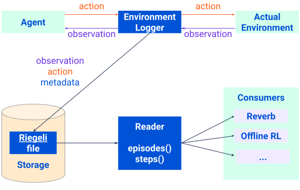

# EnvironmentLogger

`EnvLogger` is a standard `dm_env.Environment` class wrapper that
records interactions between a real environment and an agent. These interactions
are saved on disk as trajectories and can be retrieved in whole, by individual
timesteps or by specific episodes.



## Metadata

To better categorize your logged data, you may want to add some tags in the
metadata when you construct the logger wrapper.  The metadata is written once
per `EnvLogger` instance.

```python
env = envlogger.EnvLogger(
    env,
    data_directory='/tmp/experiment_logs',
    metadata={
        'environment_type': 'dm_control',
        'agent_type': 'D4PG'
    })
```
## Examples

Most of the time, it is just a one-liner wrapper, e.g.

```python
import envlogger
from envlogger.testing import catch_env

env = catch_env.Catch()
env = envlogger.EnvLogger(
    env, data_directory='tmp/experiment_logs')
```

## Reading stored trajectories

`Reader` can read stored trajectories. Example:

```python
from envlogger import reader

with reader.Reader(directory) as reader:
  for episode in reader.episodes:
    for step in episode:
       # step is a step_data.StepData.
       # Use step.timestep.observation, step.timestep.reward, step.action etc...
```

## Getting Started

### Installation

> EnvLogger currently only supports Linux based OSes.

You'll need Docker set up on your machine and then:

```
git clone https://github.com/deepmind/envlogger/
cd envlogger
sh docker/build.sh  # may require sudo
docker run -it envlogger bash  # may require sudo
bazel test --test_output=errors //envlogger/...
```

## Acknowledgements

We greatly appreciate all the support from the
[TF-Agents](https://github.com/tensorflow/agents) team in setting up building
and testing for EnvLogger.
